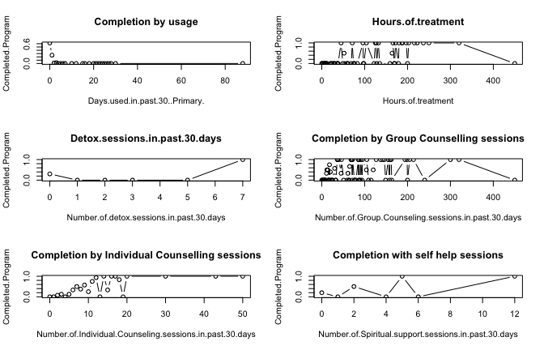
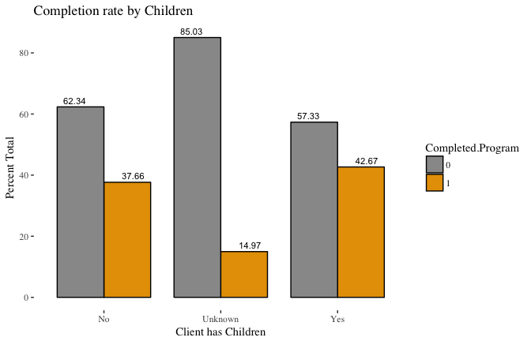
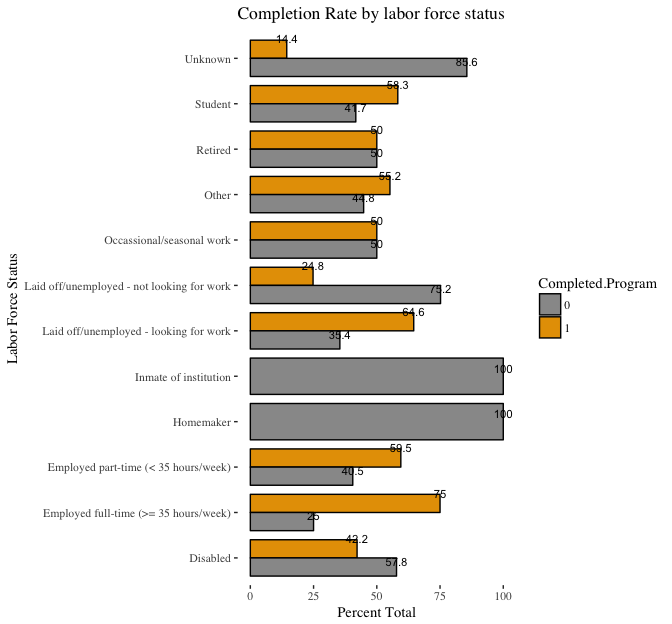
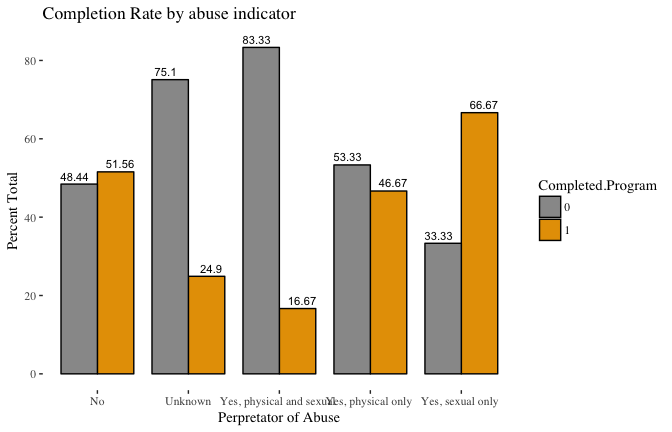
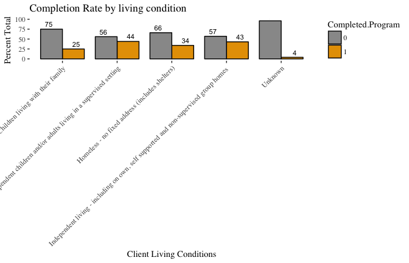
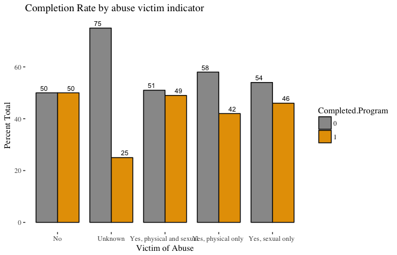
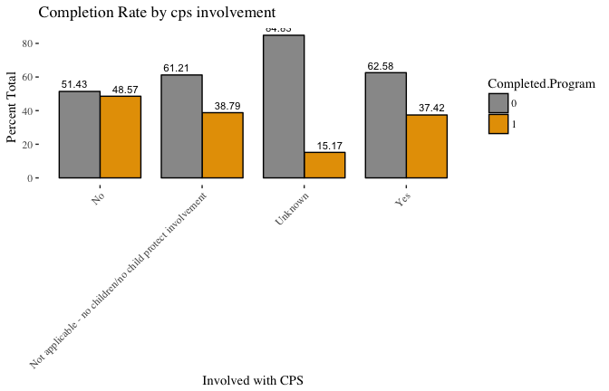

## Introduction  

Exploratory Data Analysis(EDA) of the Avivo Admissions data.We also have the discharge data that needs to be
integrated with the Admissions data but for this walkthrough we would focus on the Admissions file

<br>


### Load packages and data

```r
rm(list=ls())
library(dplyr)
library(tidyr)
library(data.table)
library(lubridate)
library(ggplot2)
library(ggthemes)
setwd("~/teamavivo")
```


```r
# lets get the admission data in first 

dat <- as_data_frame(fread("Daanes admissions 1.1.14-12.31.17.csv",header = TRUE,
                           na.strings=c("NA","NaN","","N/A","unknown","unknwn","None","-","Na"," ","99"),sep =",",
                           skip = 0,stringsAsFactors = TRUE,check.names = T))


# We first check the size and structure of data
dim(dat)
```

```
## [1] 1789   64
```

```r
summary(dat)
```

```
##     Form Date    Form Ineffective Date
##  10/28/16:  10   Mode:logical         
##  12/15/17:  10   NA's:1789            
##  9/16/16 :  10                        
##  10/13/17:   9                        
##  11/6/15 :   9                        
##  12/18/15:   9                        
##  (Other) :1732                        
##                             Program                     Staff    
##  Treatment - IDD Men            :565   Jackson, Jacinta    :231  
##  Treatment - IDD Women          :502   Roche, Maria        :194  
##  Treatment - Relapse Men        :207   Owusu-Asante, Thomas:182  
##  Family Residential             :174   Istok, Eden         :146  
##  Treatment - Family - Outpatient:157   Lowe, Shannon       :102  
##  Women's Residential            : 85   Tirivepi, Niki      : 82  
##  (Other)                        : 99   (Other)             :852  
##    Client Number 
##  111157844:   4  
##  111157920:   4  
##  111160126:   4  
##  111156150:   3  
##  111156354:   3  
##  111156731:   3  
##  (Other)  :1768  
##                           Any children living else where due to CPS court order or action
##  No                                                       :103                           
##  Not applicable - no children/no child protect involvement:973                           
##  Unknown                                                  :454                           
##  Yes                                                      :259                           
##                                                                                          
##                                                                                          
##                                                                                          
##                                                        CD Treatments used
##  NA                                                             :1552    
##  Anti-depressant medication, Anti-Anxiety medication            :  70    
##  Methadone                                                      :  70    
##  Anti-depressant medication                                     :  40    
##  Anti-Anxiety medication                                        :  12    
##  Methadone, Anti-depressant medication, Anti-Anxiety medication :  11    
##  (Other)                                                        :  34    
##          CHSR Dimension 1         CHSR Dimension 2
##  Extreme problem : 16     Extreme problem : 13    
##  Minor problem   :400     Minor problem   :813    
##  Moderate problem:187     Moderate problem:245    
##  No problem      :971     No problem      :526    
##  Serious problem : 68     Serious problem : 43    
##  Unable to assess:147     Unable to assess:149    
##                                                   
##          CHSR Dimension 3         CHSR Dimension 4
##  Extreme problem : 38     Extreme problem :106    
##  Minor problem   :440     Minor problem   :395    
##  Moderate problem:847     Moderate problem:511    
##  No problem      : 94     No problem      :281    
##  Serious problem :224     Serious problem :390    
##  Unable to assess:146     Unable to assess:106    
##                                                   
##          CHSR Dimension 5         CHSR Dimension 6
##  Extreme problem :385     Extreme problem :539    
##  Minor problem   :241     Minor problem   :139    
##  Moderate problem:392     Moderate problem:254    
##  No problem      :100     No problem      : 97    
##  Serious problem :557     Serious problem :457    
##  Unable to assess:114     Unable to assess:303    
##                                                   
##                                             CPS involvement results from
##  Alleged abuse or neglect by client                       : 231         
##  Alleged abuse or neglect by client and someone else      :  12         
##  Alleged abuse or neglect by someone else                 :  14         
##  Not applicable - no children/no child protect involvement:1028         
##  Some other reason                                        :  34         
##  Unknown                                                  : 470         
##                                                                         
##                               Current CD Treatment
##  Hospital inpatient                     :   1     
##  Methadone clinic                       :   2     
##  Non-residential                        :1499     
##  Residential, less than 30 days planned :  16     
##  Residential, more than 30 days planned : 271     
##                                                   
##                                                   
##                               Current labor force status
##  Laid off/unemployed - not looking for work:697         
##  Laid off/unemployed - looking for work    :435         
##  Unknown                                   :404         
##  Disabled                                  : 90         
##  Employed part-time (< 35 hours/week)      : 74         
##  Employed full-time (>= 35 hours/week)     : 36         
##  (Other)                                   : 53         
##                                             Currently involved with CPS
##  No                                                       :525         
##  Not applicable - no children/no child protect involvement:544         
##  Unknown                                                  :402         
##  Yes                                                      :318         
##                                                                        
##                                                                        
##                                                                        
##  Days used in past 30 (Primary) Days used in past 30 (Tertiary)
##  NA     :746                    NA     :1332                   
##  0      :685                    0      : 252                   
##  1      :103                    30     : 132                   
##  2      : 65                    88     :  17                   
##  88     : 48                    1      :  15                   
##  3      : 43                    2      :  12                   
##  (Other): 99                    (Other):  29                   
##  Days used in past 30 days (Secondary)
##  NA     :1074                         
##  0      : 454                         
##  30     :  73                         
##  1      :  56                         
##  88     :  36                         
##  2      :  33                         
##  (Other):  63                         
##  Did you receive treatment in language you understood
##  No     :  9                                         
##  Unknown:810                                         
##  Yes    :970                                         
##                                                      
##                                                      
##                                                      
##                                                      
##                   Disabilities or Barriers to Treatment
##  NA                                  :1410             
##  Mental illness                      : 299             
##  Brain injury                        :  19             
##  Mental illness, Learning disability :  11             
##  Learning disability                 :   6             
##  Mental illness, Brain injury        :   4             
##  (Other)                             :  40             
##  Does client have children
##  No     : 385             
##  Unknown: 354             
##  Yes    :1050             
##                           
##                           
##                           
##                           
##                                                                   DSM CD Diagnosis
##  Alcohol Use Disorder Moderate/Severe                                     :283    
##  Alcohol Dependence                                                       :230    
##  Opioid Use Disorder Moderate/Severe                                      :217    
##  Stimulant Related Disorder (Cocaine) Moderate/Severe                     :166    
##  Stimulant Related Disorder (Amphetamine/Other Stimulants) Moderate/Severe:148    
##  Cannabis Use Disorder Moderate/Severe                                    :135    
##  (Other)                                                                  :610    
##                                         DSM CD Diagnosis (Secondary)
##  No Secondary Diagnosis                               :849          
##  Cannabis Use Disorder Moderate/Severe                :126          
##  Cannabis (marijuana) dependence                      :101          
##  Alcohol Use Disorder Moderate/Severe                 :100          
##  Stimulant Related Disorder (Cocaine) Moderate/Severe : 79          
##  Tobacco Use Disorder Moderate/Severe - Only Secondary: 74          
##  (Other)                                              :460          
##     Enrolled in school or job training Hours of treatment
##  Enrolled, full time :  60             NA     :1721      
##  Enrolled, part time :  39             0      :   2      
##  Not enrolled        :1328             11     :   2      
##  Unknown             : 362             12     :   2      
##                                        164    :   2      
##                                        20     :   2      
##                                        (Other):  58      
##  How much were you helped by treatment
##  A little  :  92                      
##  A lot     : 466                      
##  Not at all:  50                      
##  Somewhat  : 145                      
##  Unknown   :1036                      
##                                       
##                                       
##        If no, what language do you speak
##  NA                     :1635           
##  (Yes to prior question):  48           
##  Other, specify         :   2           
##  Somali                 :   5           
##  Spanish                :   1           
##  Unknown                :  98           
##                                         
##  Number of  sessions living skills development in past 30 days
##  NA     :1700                                                 
##  0      :  29                                                 
##  1      :  10                                                 
##  20     :   7                                                 
##  10     :   3                                                 
##  3      :   3                                                 
##  (Other):  37                                                 
##  Number of alcohol/drug testing sessions in past 30 days
##  Min.   :  0.000                                        
##  1st Qu.:  3.000                                        
##  Median :  6.500                                        
##  Mean   :  9.504                                        
##  3rd Qu.: 12.000                                        
##  Max.   :104.000                                        
##  NA's   :1521                                           
##  Number of arrests in past 30 days
##  NA :1174                         
##  0  : 578                         
##  1  :  30                         
##  10 :   1                         
##  2  :   4                         
##  3  :   1                         
##  Yes:   1                         
##  Number of Childcare sessions in past 30 days
##  NA     :1704                                
##  0      :  56                                
##  40     :   4                                
##  10     :   3                                
##  20     :   3                                
##  60     :   3                                
##  (Other):  16                                
##               Number of children
##  Unknown               :511     
##  Client has no children:374     
##  Two                   :272     
##  One                   :258     
##  Three                 :207     
##  Four                  : 86     
##  (Other)               : 81     
##                 Number of children client lost parental rights to
##  No children/no child protect involvement:1061                   
##  Unknown                                 : 610                   
##  One                                     :  55                   
##  Two                                     :  25                   
##  Three                                   :  22                   
##  Four                                    :  10                   
##  (Other)                                 :   6                   
##                        Number of children living elsewhere
##  No children/no child protect involvement:1040            
##  Unknown                                 : 475            
##  One                                     : 101            
##  Two                                     :  80            
##  Three                                   :  41            
##  Four                                    :  24            
##  (Other)                                 :  28            
##  Number of Co-Occurring mental illness sessions in past 30 days
##  NA     :1679                                                  
##  0      :  22                                                  
##  2      :  13                                                  
##  1      :  10                                                  
##  12     :   9                                                  
##  3      :   8                                                  
##  (Other):  48                                                  
##  Number of Coordination of services sessions in past 30 days
##  NA     :1706                                               
##  0      :  31                                               
##  1      :  12                                               
##  2      :  10                                               
##  4      :   8                                               
##  8      :   5                                               
##  (Other):  17                                               
##  Number of days client used alcohol in past 30 days
##  NA     :1035                                      
##  0      : 647                                      
##  1      :  43                                      
##  2      :  24                                      
##  3      :  16                                      
##  4      :   9                                      
##  (Other):  15                                      
##  Number of days client used illicit drugs in past 30 days
##  NA     :1018                                            
##  0      : 578                                            
##  1      :  56                                            
##  2      :  40                                            
##  3      :  35                                            
##  4      :  18                                            
##  (Other):  44                                            
##  Number of detox sessions in past 30 days
##  NA:1717                                 
##  0 :  66                                 
##  1 :   2                                 
##  2 :   1                                 
##  3 :   1                                 
##  5 :   1                                 
##  7 :   1                                 
##  Number of Employment/Education sessions in past 30 days
##  NA:1732                                                
##  0 :  56                                                
##  1 :   1                                                
##                                                         
##                                                         
##                                                         
##                                                         
##  Number of Group Counseling sessions in past 30 days
##  NA     :1640                                       
##  0      :   8                                       
##  30     :   7                                       
##  12     :   6                                       
##  14     :   6                                       
##  2      :   5                                       
##  (Other): 117                                       
##  Number of Individual Counseling sessions in past 30 days
##  NA     :1642                                            
##  1      :  16                                            
##  3      :  16                                            
##  12     :  15                                            
##  2      :  13                                            
##  4      :  12                                            
##  (Other):  75                                            
##  Number of interactions with supportive family/friends in past 30 days
##  No     :203                                                          
##  Unknown:640                                                          
##  Yes    :946                                                          
##                                                                       
##                                                                       
##                                                                       
##                                                                       
##  Number of Medical Care sessions in past 30 days
##  NA     :1697                                   
##  0      :  28                                   
##  1      :  22                                   
##  4      :  11                                   
##  10     :   6                                   
##  3      :   6                                   
##  (Other):  19                                   
##  Number of Relationship/Family Counseling sessions in past 30 days
##  NA     :1695                                                     
##  0      :  41                                                     
##  12     :   7                                                     
##  1      :   6                                                     
##  3      :   6                                                     
##  0.0    :   5                                                     
##  (Other):  29                                                     
##                     Number of self-help programs attended in past 30 days
##  1-3 times past month (less than once per week):321                      
##  16-30 times past month (0ver 3 times per week): 47                      
##  4-7 times past month (once per week)          :191                      
##  8-15 times past month (2 or 3 times per week) :307                      
##  No attendance                                 :406                      
##  Some attendance, but frequency unknown        :126                      
##  Unknown                                       :391                      
##  Number of Spiritual support sessions in past 30 days
##  NA     :1730                                        
##  0      :  50                                        
##  1      :   3                                        
##  2      :   2                                        
##  12     :   1                                        
##  4      :   1                                        
##  (Other):   2                                        
##  Number of Substance Abuse Education sessions in past 30 days
##  NA     :1622                                                
##  12     :  20                                                
##  0      :  16                                                
##  1      :  15                                                
##  8      :  12                                                
##  15     :  11                                                
##  (Other):  93                                                
##  Number of Therapeutic recreation sessions in past 30 days
##  NA     :1706                                             
##  0      :  48                                             
##  4      :   8                                             
##  20     :   4                                             
##  5      :   4                                             
##  12     :   3                                             
##  (Other):  16                                             
##  Number of Transportation services in past 30 days Other language
##  NA     :1700                                      NA     :1787  
##  0      :  35                                      English:   1  
##  12     :  11                                      english:   1  
##  1      :   5                                                    
##  6      :   5                                                    
##  10     :   4                                                    
##  (Other):  29                                                    
##                 Perpetrator of Abuse
##  No                       : 671     
##  Unknown                  :1016     
##  Yes, physical and sexual :   6     
##  Yes, physical only       :  90     
##  Yes, sexual only         :   6     
##                                     
##                                     
##                           Reason for Discharge
##  Completed program                  :646      
##  Patient left without staff approval:551      
##  Patient conduct (behavioral)       :349      
##  Transferred to other program       :123      
##  Other                              : 46      
##  Assessed as inappropriate          : 33      
##  (Other)                            : 41      
##                                                                                                                                        Referrals at discharge
##  NA                                                                                                                                               :1018      
##  Additional CD treatment                                                                                                                          : 155      
##  CD aftercare/support group, professionally led                                                                                                   : 131      
##  Additional CD treatment, Individual counseling/therapy                                                                                           :  39      
##  Additional CD treatment, Law enforcement/corrections                                                                                             :  36      
##  Additional CD treatment, CD aftercare/support group, self-help, CD board and lodging, Individual counseling/therapy, Law enforcement/corrections :  25      
##  (Other)                                                                                                                                          : 385      
##                      Secondary substance abuse problem
##  No secondary or tertiary substance   :635            
##  Marijuana/Hashish                    :285            
##  Alcohol                              :174            
##  Unknown                              :150            
##  Methamphetamine                      :122            
##  Nicotine/Tobacco (May not be primary):116            
##  (Other)                              :307            
##        Substance abuse problem at Discharge
##  Alcohol                 :576              
##  Heroin                  :250              
##  Methamphetamine         :250              
##  Crack                   :218              
##  Marijuana/Hashish       :216              
##  Other Opiates/Synthetics: 88              
##  (Other)                 :191              
##                       Tertiary substance abuse problem
##  No secondary or tertiary substance   :1055           
##  Unknown                              : 332           
##  Nicotine/Tobacco (May not be primary): 188           
##  Marijuana/Hashish                    :  60           
##  Alcohol                              :  48           
##  Methamphetamine                      :  27           
##  (Other)                              :  79           
##  Total Charges (dollars only)                  Victim of abuse
##  NA     :1761                 No                       :308   
##  0      :   1                 Unknown                  :937   
##  10,819 :   1                 Yes, physical and sexual :360   
##  1498   :   1                 Yes, physical only       :149   
##  2639   :   1                 Yes, sexual only         : 35   
##  2755   :   1                                                 
##  (Other):  23                                                 
##  Were treatment services respectful of culture
##  No     :  6                                  
##  Unknown:914                                  
##  Yes    :869                                  
##                                               
##                                               
##                                               
##                                               
##                                                                 Where client has been living in past 30 days
##  Children living with their family                                                    :  8                  
##  Dependent living - dependent children and/or adults living in a supervised setting   :576                  
##  Homeless - no fixed address (includes shelters)                                      :687                  
##  Independent living - including on own, self supported and non-supervised group homes :344                  
##  Unknown                                                                              :174                  
##                                                                                                             
##                                                                                                             
##  Will client be living in environment  conducive to recovery
##  No     :153                                                
##  Unknown:996                                                
##  Yes    :640                                                
##                                                             
##                                                             
##                                                             
## 
```

```r
str(dat)
```

```
## Classes 'tbl_df', 'tbl' and 'data.frame':	1789 obs. of  64 variables:
##  $ Form Date                                                            : Factor w/ 666 levels "1/1/15","1/10/16",..: 615 646 651 46 46 74 87 94 138 158 ...
##  $ Form Ineffective Date                                                : logi  NA NA NA NA NA NA ...
##  $ Program                                                              : Factor w/ 19 levels "ARMHS - Princeton/St. Cloud",..: 14 14 15 15 15 13 15 15 14 15 ...
##  $ Staff                                                                : Factor w/ 43 levels "Ackerman, Christopher",..: 31 31 34 34 34 34 31 25 31 25 ...
##  $ Client Number                                                        : Factor w/ 1577 levels "10007","10023",..: 1544 27 59 74 31 8 30 45 49 87 ...
##  $ Any children living else where due to CPS court order or action      : Factor w/ 4 levels "No","Not applicable - no children/no child protect involvement",..: 2 2 2 2 2 2 2 1 2 3 ...
##  $ CD Treatments used                                                   : Factor w/ 20 levels NA,"Antabuse, Anti-depressant medication, Anti-Anxiety medication ",..: 1 1 1 1 1 1 6 1 1 1 ...
##  $ CHSR Dimension 1                                                     : Factor w/ 6 levels "Extreme problem",..: 4 4 3 4 2 4 4 4 4 4 ...
##  $ CHSR Dimension 2                                                     : Factor w/ 6 levels "Extreme problem",..: 4 4 2 5 3 2 4 4 4 4 ...
##  $ CHSR Dimension 3                                                     : Factor w/ 6 levels "Extreme problem",..: 3 2 3 3 3 5 3 2 3 2 ...
##  $ CHSR Dimension 4                                                     : Factor w/ 6 levels "Extreme problem",..: 3 3 5 3 1 5 2 2 3 2 ...
##  $ CHSR Dimension 5                                                     : Factor w/ 6 levels "Extreme problem",..: 5 3 5 5 1 5 5 3 3 3 ...
##  $ CHSR Dimension 6                                                     : Factor w/ 6 levels "Extreme problem",..: 3 3 1 3 1 3 5 2 3 3 ...
##  $ CPS involvement results from                                         : Factor w/ 6 levels "Alleged abuse or neglect by client",..: 4 4 4 4 4 4 4 4 4 6 ...
##  $ Current CD Treatment                                                 : Factor w/ 5 levels "Hospital inpatient",..: 5 3 3 3 3 3 3 3 3 3 ...
##  $ Current labor force status                                           : Factor w/ 12 levels "Disabled","Employed full-time (>= 35 hours/week)",..: 6 7 7 7 7 7 7 6 7 12 ...
##  $ Currently involved with CPS                                          : Factor w/ 4 levels "No","Not applicable - no children/no child protect involvement",..: 2 1 1 2 2 2 3 1 2 3 ...
##  $ Days used in past 30 (Primary)                                       : Factor w/ 29 levels NA,"0","1","10",..: 1 1 2 2 2 2 3 1 2 1 ...
##  $ Days used in past 30 (Tertiary)                                      : Factor w/ 22 levels NA,"0","1","10",..: 1 1 2 2 2 2 1 2 1 1 ...
##  $ Days used in past 30 days (Secondary)                                : Factor w/ 25 levels NA,"0","1","10",..: 1 1 16 2 2 2 1 2 2 1 ...
##  $ Did you receive treatment in language you understood                 : Factor w/ 3 levels "No","Unknown",..: 3 2 2 2 2 2 2 2 3 2 ...
##  $ Disabilities or Barriers to Treatment                                : Factor w/ 29 levels NA,"Brain injury",..: 1 17 17 17 17 17 17 17 17 1 ...
##  $ Does client have children                                            : Factor w/ 3 levels "No","Unknown",..: 3 3 3 1 1 3 3 3 1 2 ...
##  $ DSM CD Diagnosis                                                     : Factor w/ 29 levels "Alcohol Dependence",..: 9 6 29 29 29 8 1 9 1 27 ...
##  $ DSM CD Diagnosis (Secondary)                                         : Factor w/ 34 levels "Alcohol Abuse",..: 8 19 19 10 19 19 19 8 8 10 ...
##  $ Enrolled in school or job training                                   : Factor w/ 4 levels "Enrolled, full time ",..: 3 4 3 3 3 3 3 3 3 3 ...
##  $ Hours of treatment                                                   : Factor w/ 60 levels NA,"0","1","104",..: 1 56 1 1 1 1 52 18 1 1 ...
##  $ How much were you helped by treatment                                : Factor w/ 5 levels "A little","A lot",..: 5 5 5 5 5 5 5 5 5 5 ...
##  $ If no, what language do you speak                                    : Factor w/ 6 levels NA,"(Yes to prior question)",..: 1 6 1 1 1 1 6 1 1 1 ...
##  $ Number of  sessions living skills development in past 30 days        : Factor w/ 28 levels NA,"0","1","10",..: 1 1 1 1 1 1 1 1 1 1 ...
##  $ Number of alcohol/drug testing sessions in past 30 days              : int  NA NA NA NA NA NA NA 16 NA NA ...
##  $ Number of arrests in past 30 days                                    : Factor w/ 7 levels NA,"0","1","10",..: 1 1 1 1 1 2 2 2 1 1 ...
##  $ Number of Childcare sessions in past 30 days                         : Factor w/ 19 levels NA,"0","10","12",..: 1 1 1 1 1 1 1 1 1 1 ...
##  $ Number of children                                                   : Factor w/ 11 levels "Client has no children",..: 10 5 5 1 1 10 9 9 1 11 ...
##  $ Number of children client lost parental rights to                    : Factor w/ 9 levels "Five","Four",..: 3 3 3 3 3 3 3 3 3 9 ...
##  $ Number of children living elsewhere                                  : Factor w/ 11 levels "Five","Four",..: 4 4 4 4 4 4 4 4 4 11 ...
##  $ Number of Co-Occurring mental illness sessions in past 30 days       : Factor w/ 26 levels NA,"0","1","10",..: 1 18 1 1 1 1 1 18 1 1 ...
##  $ Number of Coordination of services sessions in past 30 days          : Factor w/ 13 levels NA,"0","1","10",..: 1 1 1 1 1 1 1 1 1 1 ...
##  $ Number of days client used alcohol in past 30 days                   : Factor w/ 17 levels NA,"0","1","12",..: 1 1 14 2 2 2 3 2 1 1 ...
##  $ Number of days client used illicit drugs in past 30 days             : Factor w/ 27 levels NA,"0","1","10",..: 1 1 2 2 2 2 1 2 1 1 ...
##  $ Number of detox sessions in past 30 days                             : Factor w/ 7 levels NA,"0","1","2",..: 1 1 1 1 1 1 1 1 1 1 ...
##  $ Number of Employment/Education sessions in past 30 days              : Factor w/ 3 levels NA,"0","1": 1 1 1 1 1 1 1 1 1 1 ...
##  $ Number of Group Counseling sessions in past 30 days                  : Factor w/ 76 levels NA,"0","1","10",..: 1 63 49 40 38 34 60 56 1 1 ...
##  $ Number of Individual Counseling sessions in past 30 days             : Factor w/ 25 levels NA,"0","1","10",..: 1 25 23 14 16 12 16 5 1 1 ...
##  $ Number of interactions with supportive family/friends in past 30 days: Factor w/ 3 levels "No","Unknown",..: 2 3 2 2 2 3 3 3 2 2 ...
##  $ Number of Medical Care sessions in past 30 days                      : Factor w/ 13 levels NA,"0","1","10",..: 1 1 1 1 1 1 1 1 1 1 ...
##  $ Number of Relationship/Family Counseling sessions in past 30 days    : Factor w/ 19 levels NA,"0","0.0","1",..: 1 1 1 1 1 1 1 1 1 1 ...
##  $ Number of self-help programs attended in past 30 days                : Factor w/ 7 levels "1-3 times past month (less than once per week)",..: 3 7 7 7 7 7 1 2 4 7 ...
##  $ Number of Spiritual support sessions in past 30 days                 : Factor w/ 8 levels NA,"0","1","12",..: 1 1 1 1 1 1 1 1 1 1 ...
##  $ Number of Substance Abuse Education sessions in past 30 days         : Factor w/ 41 levels NA,"0","1","10",..: 1 1 1 1 1 1 1 1 1 1 ...
##  $ Number of Therapeutic recreation sessions in past 30 days            : Factor w/ 16 levels NA,"0","1","10",..: 1 1 1 1 1 1 1 1 1 1 ...
##  $ Number of Transportation services in past 30 days                    : Factor w/ 20 levels NA,"0","1","10",..: 1 1 1 1 1 1 1 1 1 1 ...
##  $ Other language                                                       : Factor w/ 3 levels NA,"English","english": 1 1 1 1 1 1 1 1 1 1 ...
##  $ Perpetrator of Abuse                                                 : Factor w/ 5 levels "No","Unknown",..: 1 1 1 4 1 1 1 1 1 2 ...
##  $ Reason for Discharge                                                 : Factor w/ 9 levels "Assessed as inappropriate",..: 2 7 8 8 9 2 2 2 2 8 ...
##  $ Referrals at discharge                                               : Factor w/ 169 levels NA,"Additional CD treatment",..: 94 1 87 90 34 96 136 149 94 43 ...
##  $ Secondary substance abuse problem                                    : Factor w/ 20 levels "Alcohol","Benzodiazepines",..: 9 12 1 9 12 12 12 9 9 9 ...
##  $ Substance abuse problem at Discharge                                 : Factor w/ 17 levels "Alcohol","Benzodiazepines",..: 4 8 3 3 5 8 1 4 1 9 ...
##  $ Tertiary substance abuse problem                                     : Factor w/ 19 levels "Alcohol","Benzodiazepines",..: 19 12 12 15 12 12 12 1 12 15 ...
##  $ Total Charges (dollars only)                                         : Factor w/ 29 levels NA,"0","10,819",..: 1 28 1 1 1 1 19 21 1 1 ...
##  $ Victim of abuse                                                      : Factor w/ 5 levels "No","Unknown",..: 1 1 3 1 3 3 3 3 1 2 ...
##  $ Were treatment services respectful of culture                        : Factor w/ 3 levels "No","Unknown",..: 2 2 2 2 2 2 2 2 2 2 ...
##  $ Where client has been living in past 30 days                         : Factor w/ 5 levels "Children living with their family",..: 4 4 4 2 2 2 4 2 4 2 ...
##  $ Will client be living in environment  conducive to recovery          : Factor w/ 3 levels "No","Unknown",..: 3 2 2 2 2 3 3 3 3 2 ...
##  - attr(*, ".internal.selfref")=<externalptr>
```

```r
head(dat)
```

```
## # A tibble: 6 × 64
##   `Form Date` `Form Ineffective Date`                         Program
##        <fctr>                   <lgl>                          <fctr>
## 1     9/12/14                      NA             Treatment - IDD Men
## 2     9/26/14                      NA             Treatment - IDD Men
## 3     9/29/14                      NA           Treatment - IDD Women
## 4     10/1/14                      NA           Treatment - IDD Women
## 5     10/1/14                      NA           Treatment - IDD Women
## 6    10/22/14                      NA Treatment - Family - Outpatient
## # ... with 61 more variables: Staff <fctr>, `Client Number` <fctr>, `Any
## #   children living else where due to CPS court order or action` <fctr>,
## #   `CD Treatments used` <fctr>, `CHSR Dimension 1` <fctr>, `CHSR
## #   Dimension 2` <fctr>, `CHSR Dimension 3` <fctr>, `CHSR Dimension
## #   4` <fctr>, `CHSR Dimension 5` <fctr>, `CHSR Dimension 6` <fctr>, `CPS
## #   involvement results from` <fctr>, `Current CD Treatment` <fctr>,
## #   `Current labor force status` <fctr>, `Currently involved with
## #   CPS` <fctr>, `Days used in past 30 (Primary)` <fctr>, `Days used in
## #   past 30 (Tertiary)` <fctr>, `Days used in past 30 days
## #   (Secondary)` <fctr>, `Did you receive treatment in language you
## #   understood` <fctr>, `Disabilities or Barriers to Treatment` <fctr>,
## #   `Does client have children` <fctr>, `DSM CD Diagnosis` <fctr>, `DSM CD
## #   Diagnosis (Secondary)` <fctr>, `Enrolled in school or job
## #   training` <fctr>, `Hours of treatment` <fctr>, `How much were you
## #   helped by treatment` <fctr>, `If no, what language do you
## #   speak` <fctr>, `Number of sessions living skills development in past
## #   30 days` <fctr>, `Number of alcohol/drug testing sessions in past 30
## #   days` <int>, `Number of arrests in past 30 days` <fctr>, `Number of
## #   Childcare sessions in past 30 days` <fctr>, `Number of
## #   children` <fctr>, `Number of children client lost parental rights
## #   to` <fctr>, `Number of children living elsewhere` <fctr>, `Number of
## #   Co-Occurring mental illness sessions in past 30 days` <fctr>, `Number
## #   of Coordination of services sessions in past 30 days` <fctr>, `Number
## #   of days client used alcohol in past 30 days` <fctr>, `Number of days
## #   client used illicit drugs in past 30 days` <fctr>, `Number of detox
## #   sessions in past 30 days` <fctr>, `Number of Employment/Education
## #   sessions in past 30 days` <fctr>, `Number of Group Counseling sessions
## #   in past 30 days` <fctr>, `Number of Individual Counseling sessions in
## #   past 30 days` <fctr>, `Number of interactions with supportive
## #   family/friends in past 30 days` <fctr>, `Number of Medical Care
## #   sessions in past 30 days` <fctr>, `Number of Relationship/Family
## #   Counseling sessions in past 30 days` <fctr>, `Number of self-help
## #   programs attended in past 30 days` <fctr>, `Number of Spiritual
## #   support sessions in past 30 days` <fctr>, `Number of Substance Abuse
## #   Education sessions in past 30 days` <fctr>, `Number of Therapeutic
## #   recreation sessions in past 30 days` <fctr>, `Number of Transportation
## #   services in past 30 days` <fctr>, `Other language` <fctr>,
## #   `Perpetrator of Abuse` <fctr>, `Reason for Discharge` <fctr>,
## #   `Referrals at discharge` <fctr>, `Secondary substance abuse
## #   problem` <fctr>, `Substance abuse problem at Discharge` <fctr>,
## #   `Tertiary substance abuse problem` <fctr>, `Total Charges (dollars
## #   only)` <fctr>, `Victim of abuse` <fctr>, `Were treatment services
## #   respectful of culture` <fctr>, `Where client has been living in past
## #   30 days` <fctr>, `Will client be living in environment conducive to
## #   recovery` <fctr>
```


```
## Warning in lapply(X = X, FUN = FUN, ...): NAs introduced by coercion

## Warning in lapply(X = X, FUN = FUN, ...): NAs introduced by coercion

## Warning in lapply(X = X, FUN = FUN, ...): NAs introduced by coercion

## Warning in lapply(X = X, FUN = FUN, ...): NAs introduced by coercion

## Warning in lapply(X = X, FUN = FUN, ...): NAs introduced by coercion

## Warning in lapply(X = X, FUN = FUN, ...): NAs introduced by coercion

## Warning in lapply(X = X, FUN = FUN, ...): NAs introduced by coercion

## Warning in lapply(X = X, FUN = FUN, ...): NAs introduced by coercion

## Warning in lapply(X = X, FUN = FUN, ...): NAs introduced by coercion

## Warning in lapply(X = X, FUN = FUN, ...): NAs introduced by coercion

## Warning in lapply(X = X, FUN = FUN, ...): NAs introduced by coercion

## Warning in lapply(X = X, FUN = FUN, ...): NAs introduced by coercion

## Warning in lapply(X = X, FUN = FUN, ...): NAs introduced by coercion

## Warning in lapply(X = X, FUN = FUN, ...): NAs introduced by coercion

## Warning in lapply(X = X, FUN = FUN, ...): NAs introduced by coercion
```

#### Lets start by looking at the different programs offered by Avivo and their split


```r
#### Lets start by looking at the different programs offered by Avivo and their split
df_program <- dat %>%
  group_by(Program) %>%
  summarize(counts = n()) %>% 
  mutate(percent_total = round(counts / sum(counts) * 100,1))

ggplot(data=df_program, aes(reorder(x=Program,percent_total),y = percent_total))+ 
  geom_bar(colour="black", width=.8, stat="identity") + 
  guides(fill=FALSE) +
  xlab("Program Name") + ylab("Percent Total") +
  ggtitle("Avivo CT Programs Overview") + theme_tufte() + coord_flip() +
  geom_text(aes(label=percent_total),hjust =-.25,color='black',size=2.5)
```

<!-- -->

```r
#  Top 5 programs constitute almost 80% of the program.
```


```r
##### Lets now start looking at why patients leave the program, we have a variable called Reasons for Discharge
df_discharges <- dat %>%
  group_by(Reason.for.Discharge) %>%
  summarize(counts = n()) %>% 
  mutate(percent_total = round(counts / sum(counts) * 100,2))

ggplot(data=df_discharges, aes(reorder(x=Reason.for.Discharge,percent_total),y = percent_total))+ 
  geom_bar(colour="black", width=.8, stat="identity") + 
  guides(fill=FALSE) +
  xlab("Discharge Reason") + ylab("Percent Total") +
  ggtitle("Reason for Discharges") + theme_tufte() + coord_flip() +
  geom_text(aes(label=percent_total),hjust =-0.25,color='black',size=2.5)
```

<!-- -->

```r
# 30.8% of the patients left without staff approval, patient conduct is also a big factor, almost 20%.Wonder what that means!
```


```r
#### Let's create a flag for patients who completed the program and another flag for patients who left without staff approval and #### compare two populations
dat$Completed.Program <- 0
dat$Completed.Program <-  ifelse(dat$Reason.for.Discharge %in% c("Completed program"), 1, 0)

dat$Left.Program <- 0
dat$Left.Program <-  ifelse(trimws(dat$Reason.for.Discharge) %in% c("Patient left without staff approval","Incarcerated"), 1, 0)
```
################### For first part lets focus on the population which completed the program ##########################


```r
### Lets review the distribution of the population who completed the program by the different numeric variables we have
par(mfrow=c(3,2))
plot(aggregate(Completed.Program~Days.used.in.past.30..Primary.,data=dat, mean), type="b", main="Completion by usage")
plot(aggregate(Completed.Program~Hours.of.treatment,data=dat, mean), type="b", main="Hours.of.treatment")
plot(aggregate(Completed.Program~Number.of.detox.sessions.in.past.30.days,data=dat, mean), type="b", main="Detox.sessions.in.past.30.days")
plot(aggregate(Completed.Program~Number.of.Group.Counseling.sessions.in.past.30.days,data=dat, mean), type="b", main="Completion by Group Counselling sessions")
plot(aggregate(Completed.Program~Number.of.Individual.Counseling.sessions.in.past.30.days,data=dat, mean), type="b", main="Completion by Individual Counselling sessions")
plot(aggregate(Completed.Program~Number.of.Spiritual.support.sessions.in.past.30.days,data=dat, mean), type="b", main="Completion with self help sessions")
```

<!-- -->

```r
par(mfrow=c(1,1))
```

## Does having children show any effect on program completion?


```r
##### Lets do some comparison of the categorical variables by completion rate

dat$Completed.Program <- as.factor(dat$Completed.Program)

df_completion_children <- dat %>%
  group_by(Does.client.have.children,Completed.Program) %>%
  summarize(counts = n()) %>% 
  mutate(percent_total = round(counts / sum(counts) * 100,2))

ggplot(data=df_completion_children, aes(x=Does.client.have.children,y = percent_total,fill=Completed.Program))+ 
  geom_bar(colour="black", width=.8, stat="identity",position = 'dodge') + 
  geom_text(aes(label=percent_total),color='black',position = position_dodge(width = 1), vjust = -0.5, size = 3) +
  xlab("Client has Children") + ylab("Percent Total") +
  ggtitle("Completion rate by Children") + theme_tufte() + 
  scale_fill_manual(values=c("#999999", "#E69F00"))
```

<!-- -->

```r
# there is not much significant difference we can see between them
```

## Does labor force status have any effect on program completion?


```r
df_completion_laborforce <- dat %>%
  group_by(Current.labor.force.status,Completed.Program) %>%
  summarize(counts = n()) %>% 
  mutate(percent_total = round(counts / sum(counts) * 100,1))

ggplot(data=df_completion_laborforce, aes(x=Current.labor.force.status,y = percent_total,fill=Completed.Program)) + 
  geom_bar(colour="black", width=.8, stat="identity",position = 'dodge') + 
  geom_text(aes(label=percent_total),color='black',position = position_dodge(width = 1), vjust = -0.5, size = 3) +
  xlab("Labor Force Status") + ylab("Percent Total") +
  ggtitle("Completion Rate by labor force status") + theme_tufte() + 
  scale_fill_manual(values=c("#999999", "#E69F00")) + coord_flip()
```

<!-- -->

```r
dat$employment_flag <- 1
dat$employment_flag <-ifelse(trimws(dat$Current.labor.force.status) %in% 
                               c("Employed full-time (>= 35 hours/week)",
                                 "Employed part-time (< 35 hours/week)"),0,1)
dat$employment_flag <- as.factor(dat$employment_flag)
chisq.test(table(dat$Completed.Program,dat$employment_flag)) # very high correlation between employment and completion rate
```

```
## 
## 	Pearson's Chi-squared test with Yates' continuity correction
## 
## data:  table(dat$Completed.Program, dat$employment_flag)
## X-squared = 39.777, df = 1, p-value = 2.847e-10
```

```r
# full time or part time employment has a higher percentage of completions, even the 
# laid off who are still looking for work has a higher completion rate
```


## Does the abuse history have any correlation with program completion?

```r
df_completion_abuse <- dat %>%
  group_by(Perpetrator.of.Abuse,Completed.Program) %>%
  summarize(counts = n()) %>% 
  mutate(percent_total = round(counts / sum(counts) * 100,2)) %>% 
  select(Perpetrator.of.Abuse,Completed.Program,percent_total)


ggplot(data=df_completion_abuse, aes(x=Perpetrator.of.Abuse,y = percent_total,fill=Completed.Program))+ 
  geom_bar(colour="black", width=.8, stat="identity",position = 'dodge') + 
  geom_text(aes(label=percent_total),color='black',position = position_dodge(width = 1), vjust = -0.5, size = 3) +
  xlab("Perpretator of Abuse") + ylab("Percent Total") +
  ggtitle("Completion Rate by abuse indicator") + 
  theme_tufte() + 
  scale_fill_manual(values=c("#999999", "#E69F00")) 
```

<!-- -->

```r
dat$abuse_history_flag <- 0
dat$abuse_history_flag <-  as.factor(ifelse(trimws(dat$Perpetrator.of.Abuse) %in%
                                         c("Yes, physical and sexual","Yes, physical only","Yes, sexual only"), 1, 0))

prop.table(table(dat$Completed.Program,dat$abuse_history_flag),1)
```

```
##    
##              0          1
##   0 0.95188101 0.04811899
##   1 0.92724458 0.07275542
```

```r
chisq.test(table(dat$Completed.Program,dat$abuse_history_flag))
```

```
## 
## 	Pearson's Chi-squared test with Yates' continuity correction
## 
## data:  table(dat$Completed.Program, dat$abuse_history_flag)
## X-squared = 4.2124, df = 1, p-value = 0.04013
```

```r
# it seems like there is a very high inverse correlation between abuse history and program completion rate
```


###### Does disability have any relation with completion rate

```r
dat$disability_flag <- 1
dat$disability_flag <-ifelse(trimws(dat$Disabilities.or.Barriers.to.Treatment) == "<NA>",0,1)
dat$disability_flag[is.na(dat$disability_flag)] <- 0
dat$disability_flag <- as.factor(dat$disability_flag)
chisq.test(table(dat$Completed.Program,dat$disability_flag))
```

```
## 
## 	Pearson's Chi-squared test with Yates' continuity correction
## 
## data:  table(dat$Completed.Program, dat$disability_flag)
## X-squared = 0.0018311, df = 1, p-value = 0.9659
```

```r
# The chisquare test tells us there is no relationship here.
```

##### Does living conditions have relation with completion rate

```r
df_completion_living <- dat %>%
  group_by(Where.client.has.been.living.in.past.30.days,Completed.Program) %>%
  summarize(counts = n()) %>% 
  mutate(percent_total = round(counts / sum(counts) * 100,0)) %>% 
  select(Where.client.has.been.living.in.past.30.days,Completed.Program,percent_total)


ggplot(data=df_completion_living, aes(x=Where.client.has.been.living.in.past.30.days,y = percent_total,fill=Completed.Program)) + 
  geom_bar(colour="black", width=.8, stat="identity",position = 'dodge') + 
  geom_text(aes(label=percent_total),color='black',position = position_dodge(width = 1), vjust = -0.5, size = 3) +
  xlab("Client Living Conditions") + ylab("Percent Total") +
  ggtitle("Completion Rate by living condition") + 
  theme_tufte() + 
  scale_fill_manual(values=c("#999999", "#E69F00")) +
  theme(axis.text.x = element_text(angle = 45, hjust = 1))
```

<!-- -->

```r
# there is no significant relationship here
```

## Does the abuse history(victim) have any correlation with program completion?

```r
df_completion_abuse_victim <- dat %>%
  group_by(Victim.of.abuse,Completed.Program) %>%
  summarize(counts = n()) %>% 
  mutate(percent_total = round(counts / sum(counts) * 100,0)) %>% 
  select(Victim.of.abuse,Completed.Program,percent_total)


ggplot(data=df_completion_abuse_victim, aes(x=Victim.of.abuse,y = percent_total,fill=Completed.Program))+ 
  geom_bar(colour="black", width=.8, stat="identity",position = 'dodge') + 
  geom_text(aes(label=percent_total),color='black',position = position_dodge(width = 1), vjust = -0.5, size = 3) +
  xlab("Victim of Abuse") + ylab("Percent Total") +
  ggtitle("Completion Rate by abuse victim indicator") + 
  theme_tufte() + 
  scale_fill_manual(values=c("#999999", "#E69F00")) 
```

<!-- -->


```r
dat$abuse_victim_flag <- 0
dat$abuse_victim_flag <-  ifelse(trimws(dat$Victim.of.abuse) %in%
                                         c("Yes, physical and sexual",
                                           "Yes, physical only",
                                           "Yes, sexual only"), 1, 0)

prop.table(table(dat$Completed.Program,dat$abuse_victim_flag),1)
```

```
##    
##             0         1
##   0 0.7454068 0.2545932
##   1 0.6083591 0.3916409
```

```r
chisq.test(table(dat$Completed.Program,dat$abuse_victim_flag))
```

```
## 
## 	Pearson's Chi-squared test with Yates' continuity correction
## 
## data:  table(dat$Completed.Program, dat$abuse_victim_flag)
## X-squared = 35.988, df = 1, p-value = 1.986e-09
```

```r
# it seems like there is a very high correlation between victim abuse history and program completion rate
```


## Does child protection involvement have any correlation with program completion?

```r
df_completion_cps <- dat %>%
  group_by(Currently.involved.with.CPS,Completed.Program) %>%
  summarize(counts = n()) %>% 
  mutate(percent_total = round(counts / sum(counts) * 100,2)) %>% 
  select(Currently.involved.with.CPS,Completed.Program,percent_total)


ggplot(data=df_completion_cps, aes(x=Currently.involved.with.CPS,y = percent_total,fill=Completed.Program))+ 
  geom_bar(colour="black", width=.8, stat="identity",position = 'dodge') + 
  geom_text(aes(label=percent_total),color='black',position = position_dodge(width = 1), vjust = -0.5, size = 3) +
  xlab("Involved with CPS") + ylab("Percent Total") +
  ggtitle("Completion Rate by cps involvement") + 
  theme_tufte() + 
  scale_fill_manual(values=c("#999999", "#E69F00")) + theme(axis.text.x = element_text(angle = 45, hjust = 1))
```

<!-- -->


```r
dat$cps_history_flag <- 0
dat$cps_history_flag <-  as.factor(ifelse(trimws(dat$Currently.involved.with.CPS) %in% c("Yes"), 1, 0))

prop.table(table(dat$Completed.Program,dat$cps_history_flag),1)
```

```
##    
##             0         1
##   0 0.8258968 0.1741032
##   1 0.8157895 0.1842105
```

```r
chisq.test(table(dat$Completed.Program,dat$cps_history_flag))
```

```
## 
## 	Pearson's Chi-squared test with Yates' continuity correction
## 
## data:  table(dat$Completed.Program, dat$cps_history_flag)
## X-squared = 0.22347, df = 1, p-value = 0.6364
```

```r
# it seems like there is no orrelation between CPS and program completion rate
```
